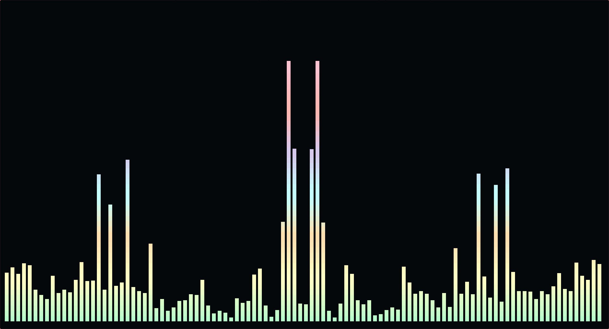

# SAGA for Cava
A dark theme for [Cava](https://github.com/karlstav/cava). 




## Installation
Replace the existing colour settings in your Cava config file (defaults to $XDG_CONFIG_HOME/cava) with the content below.

```
[color]
gradient = 1


gradient_color_1 = '#b9fdcd'
gradient_color_2 = '#ffffc6'
gradient_color_3 = '#ffe1b1'
gradient_color_4 = '#C4FFFE'
gradient_color_5 = '#d7caed'
gradient_color_6 = '#ffb7b2'
gradient_color_7 = '#ffc2d0'
gradient_color_8 = '#fad5d5'

```
